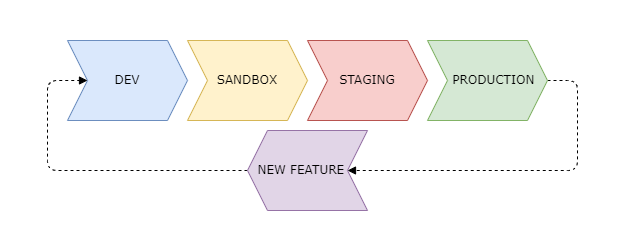

# Bookstore

## Description
The __Bookstore__ is a 2024 software application developed by Gabriel Dantas de Souza as a part of their portfolio. It aims to be a complete personal side project of mine and thus aimed for demo purposes.

## Project Status
This project is currently a work-in-progress (WIP) and is intended for demonstration purposes. While it is functional and demo-able, it may contain some bugs and incomplete features.

## Evolution
This project it embraces a microservices architecture. Each component of the application has been broken down into separate microservices to improve scalability, maintainability, and flexibility.

## Project Modes
The project operates in different modes:

| Mode         | Description                                 | Environment                     |
|:-------------|:--------------------------------------------|:--------------------------------|
| dev          | for dev development, using IDE              | localhost/local machine         |
| Sandbox      | for dev/functional testing / Demo           | Docker on local machine         |
| Staging      | for team of developers and QA story testing | AWS (EC2/EKS)                   |
| Production   | actual use                                  | AWS (EC2/EKS)                   |

The above modes maps to the project development lifecycle as specified in each microservices.



## Architecture Overview

The architecture is designed around the principles of microservices, aiming to create a scalable, resilient, and maintainable system. Each microservice is responsible for a specific domain within the application, enabling independent development, deployment, and scaling of individual components.


## Production Infrastructure

The above describes the system architecture of this application. It is structured as a collection of Docker containers, designed for portability and flexibility across various environments. To replicate a production-like environment, this demo project is hosted on the AWS Cloud Platform. It can be deployed either as Docker containers running directly within EC2 instances and orchestrated by a container management platform such as Kubernetes (AWS EKS).

For further details on this infrastructure, please refer to the sister project listed below:

- [Bookstore: Infrastructure (Docker on EC2)](https://github.com/dantas2009/bookstore-infrastructure)

## Mobile Application
In addition to the mentioned services, this project will feature a mobile application developed in __Flutter__. The application will run on both Android and iOS platforms, ensuring compatibility across a wide range of devices. It will serve as a user-friendly interface to interact with the microservices powering the bookstore platform.

This setup ensures a cohesive ecosystem where the mobile app interacts seamlessly with the backend services, providing a comprehensive and intuitive user experience across multiple platforms.

For further details on this mobile application, please refer to the sister project listed below:

- [Bookstore: App (Flutter)](https://github.com/dantas2009/bookstore-app)

## Running Application

At the root level of this project, you'll find a bash utility script named (`start-fullstack-app.sh`), which is the only script available for initiating the entire project. .

__Start Fullstack Application:__
```bash
./start-fullstack-app.sh
```

It is a wrapper bash scripts around __Docker Compose__.

## Roadmap

1. Microservices
    1. Authentication Service (auth)
    2. Customer Service (customer)
    3. Book Service (books)
    4. Order Service (order)
2. Edge Service
    1. API Gateway
3. Infrastructure
    1. Dockerize Services
    2. Kubernetes Integration
    3. Deployment on AWS EC2
4. Testing
    1. Microservices Testing
    2. Edge Service Testing
5. CI/CD 
    1. Pipeline with Jenkins

## Technologies

- Backend:
  - JWT
  - Java 17
  - PHP 8
  - Node 20
  - Rust 1
  - Spring Boot 3
  - Laravel 10
  - Express JS 4
  - Rocket 0.5
  - Swagger
- Database:
  - Postgree
  - MongoDB
  - Redis
- DevOps:
  - Docker
  - Jenkins
  - Maven
